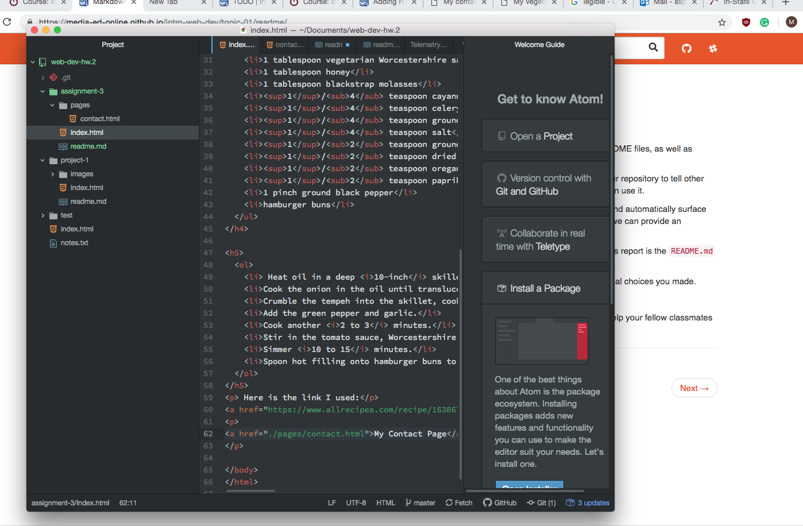

## this is my readme for assignment 3

---
A page can only have one <b>main</b> head and body elements.
The head holds information about the site such as author, style, and sizing of page but the only required element in the head is the title of the page itself.

---

The body element holds all of the data about the site. The body tells the browser how to display the information. Parts of the body are headings, paragraphs, as well as bolded and underlined words.

---

Structural markup is the structural elements of a page. This includes headings and paragraphs.

---

Semantic markup is how these structural elements are viewed. This means bold lettering, italics, underlines, abbreviations, and so forth.

---
This work cycle was still pretty difficult for me. I wish I knew more about the design element of a webpage in terms of aethetic. I used quite a few paragraphs and page breaks as style choices in order to make my page more appealing and easily legible. I still struggle with links but I just kept trying until I got them figured out! I am surprised at how much fun this is!

---

