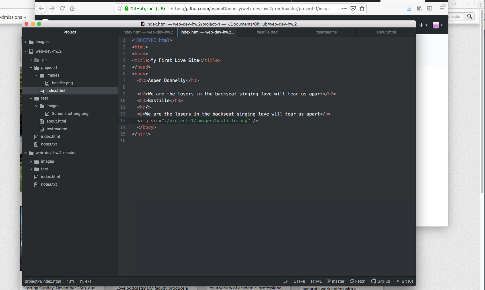

## This is my readme for project 1

The browser I typically use is firefox
---

Browsers work like a gateway and a translator for webpages. It interprets the components of a webpage and displays its content. There are several components of a browser but overall they work in harmony to make sure the webpage is viewed as intended.

---

With the Wayback Machine I went to The White House Home Page www.whitehouse.gov

I went to the year 1997. The entire webpage was the size of my screen and it was basically an archive you could search through for press releases. I was most interested in the fact that the images had completely separate links that you needed to click. The links were not just pictures they were trying to display but actual logos!  Now this website is basically a journal for government related news with lots of articles, pictures, which do not need links to view, and you can view trump's tweets on it...

---

I had a lot of problems this work cycle. The link between my github desktop and github.com broke. I could not figure out how to get them to communicate on my computer so I moved to a library computer which has worked after a long battle. Also, no matter how hard I tried I could not view my image on my website. I do not see a problem in the coding. EDIT: I changed browsers and it works on chrome!

